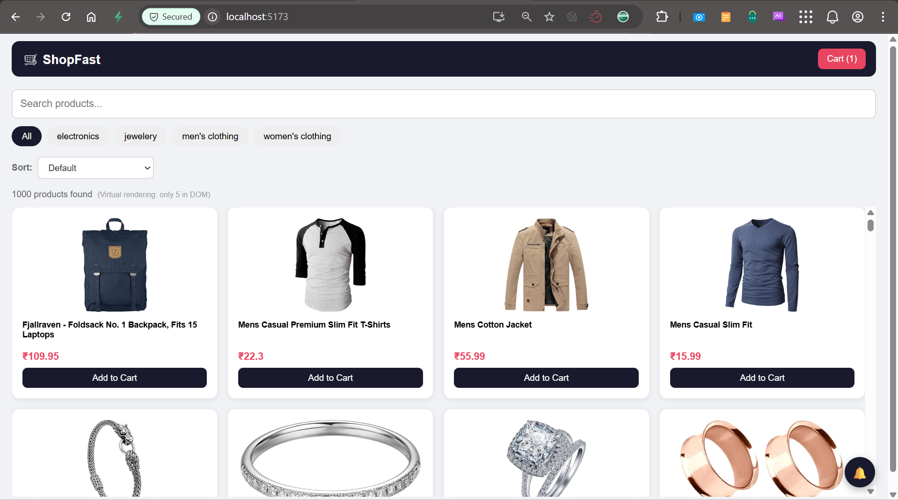
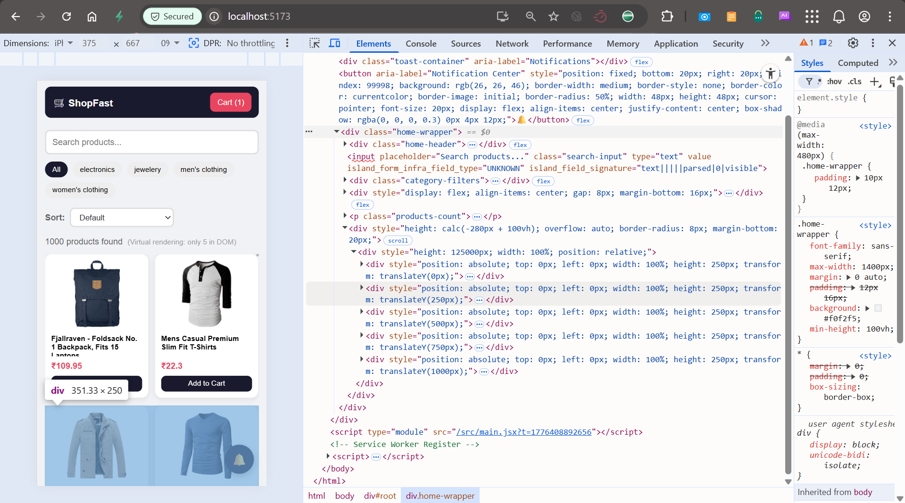
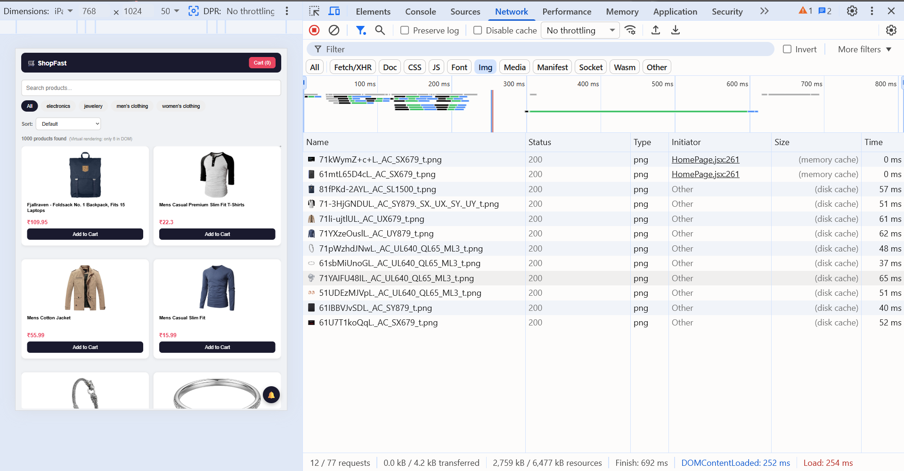

# Performance Techniques

## Overview
The application handles 1000+ products efficiently using multiple
performance optimization techniques.

---

## Technique 1: List Virtualization (Windowing)

### Library
`@tanstack/react-virtual`

### Implementation
```javascript
const virtualizer = useVirtualizer({
  count: rows.length,
  getScrollElement: () => parentRef.current,
  estimateSize: () => getRowHeight(),
  overscan: 3,
})
```

### How It Works
```
Without Virtualization:
1000 products → 1000 DOM elements → Browser lag 😵

With Virtualization:
1000 products → Only ~8-10 DOM elements rendered
→ As user scrolls, old elements removed, new ones added
→ Browser always has minimal elements ✅
```

### Evidence
UI shows: `"Virtual rendering: only 5 in DOM"`
- 1000 products in state
- Only visible rows exist in DOM
- Smooth scroll performance maintained





### Responsive Row Heights
```javascript
const getRowHeight = () => {
  if (windowWidth < 768) return 250    // Mobile
  if (windowWidth <= 1024) return 320  // iPad/Tablet
  return 320                            // Desktop
}
```

---

## Technique 2: Memoization

### useMemo - Filtered Products
```javascript
const filteredProducts = useMemo(() => {
  let result = products.filter(p => {
    const matchSearch = p.title.toLowerCase().includes(search.toLowerCase())
    const matchCategory = category === 'all' || p.category === category
    return matchSearch && matchCategory
  })
  // Sort logic...
  return result
}, [products, search, category, sortBy])
```

**Impact:** Filter/sort only recalculates when `products`, `search`,
`category`, or `sortBy` changes. Not on every render.

### useMemo - Grid Rows
```javascript
const rows = useMemo(() => {
  const result = []
  for (let i = 0; i < filteredProducts.length; i += COLUMNS) {
    result.push(filteredProducts.slice(i, i + COLUMNS))
  }
  return result
}, [filteredProducts, COLUMNS])
```

**Impact:** Row grouping only recalculates when filtered products change.

### useCallback - Add To Cart
```javascript
const handleAddToCart = useCallback((product) => {
  addItem(product)
  addNotification(`${product.title.slice(0, 20)}... added to cart!`, 'success')
}, [addItem, addNotification])
```

**Impact:** Function reference stable across renders.
Product cards don't re-render unnecessarily.

---

## Technique 3: Debounced Search

### Implementation
```javascript
// searchInput → updates on every keystroke (instant feel)
// search → updates after 400ms delay (actual filter trigger)

useEffect(() => {
  const timer = setTimeout(() => {
    setSearch(searchInput)
  }, 400)
  return () => clearTimeout(timer)
}, [searchInput])
```

### How It Works
```
Without Debounce:
User types "shirt" (5 keystrokes)
→ Filter runs 5 times on 1000 items = 5000 operations 😵

With Debounce (400ms):
User types "shirt"
→ Timer resets on each keystroke
→ Filter runs ONCE after user stops typing = 1000 operations ✅
```

---

## Technique 4: Lazy Image Loading

### Implementation
```javascript

```

### Impact
```
Without lazy loading:
Page load → All 1000 images fetch simultaneously → Slow! 😵

With lazy loading:
Page load → Only visible images fetch
→ As user scrolls → More images load
→ Fast initial load ✅
→ Network requests spread over time ✅
```



---

## Technique 5: Responsive Grid Columns

### Implementation
```javascript
const COLUMNS = windowWidth <= 768  ? 2
              : windowWidth <= 1024 ? 3
              : 4;
```

### Impact
```
Mobile  (≤768px)  → 2 columns → Fewer items per row → Less rendering
iPad    (≤1024px) → 3 columns → Balanced layout
Desktop (>1024px) → 4 columns → Full grid utilization
```

---

## Technique 6: Selective State Persistence

### Implementation
```javascript
partialize: (state) => ({
  cartItems: state.cartItems,
  checksum: state.checksum,
  idempotencyKey: state.idempotencyKey,
  isLocked: state.isLocked,
  priceSnapshot: state.priceSnapshot,
  orderState: state.orderState,
  auditLog: state.auditLog,
})
```

### Impact
```
Without partialize:
ALL state saved to localStorage on every change
→ notifications, notificationHistory etc. trigger storage events
→ TAB_SYNC false positives 😵

With partialize:
Only essential data persisted
→ No unnecessary localStorage writes
→ Tab sync works correctly ✅
→ Better performance ✅
```

---

## Performance Summary

| Technique | Where Used | Impact |
|-----------|-----------|--------|
| Virtualization | HomePage product list | 1000 items, only ~8 in DOM |
| useMemo | filteredProducts, rows | No unnecessary recalculation |
| useCallback | handleAddToCart | Stable function reference |
| Debounced Search | Search input (400ms) | Filter runs once per search |
| Lazy Images | Product card images | Fast initial load |
| Responsive Columns | Product grid | Optimized for each device |
| Selective Persist | Zustand partialize | Minimal localStorage writes |